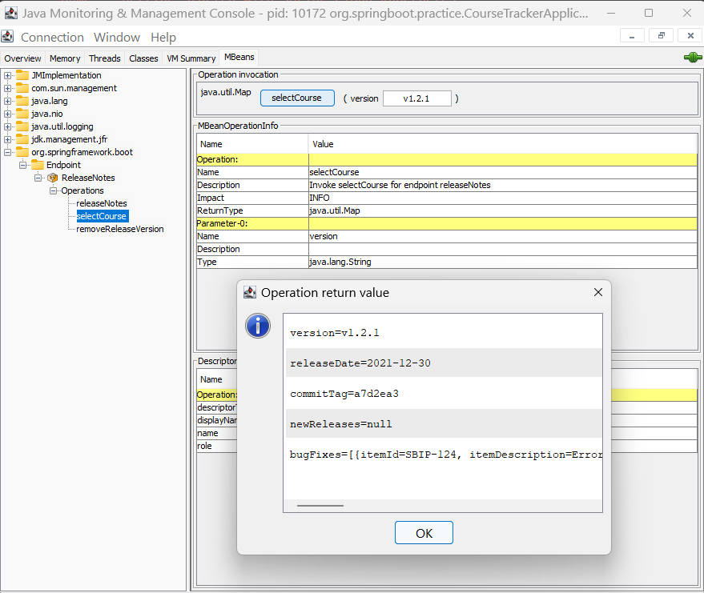

# 04. 스프링 자동 구성과 액추에이터

> 일단 내가 액추에이터에 대해서는 익숙하진 않긴하다. 😅


## 진행

### 저자님 예제

* https://github.com/spring-boot-in-practice/repo/tree/main/ch04

⬜ 한번 읽어보기


* ~ 167: 자동 구성, DevTools관련해서 간단하게 읽어봤다.

### 4.2 스프링 부트 개발자 도구

* https://docs.spring.io/spring-boot/reference/using/devtools.html#using.devtools
  * 프로퍼티 기본값
    * https://docs.spring.io/spring-boot/reference/using/devtools.html#using.devtools.property-defaults
  * 자동 재시작
    * https://docs.spring.io/spring-boot/reference/using/devtools.html#using.devtools.restart
  * 라이브 리로드
    * https://docs.spring.io/spring-boot/reference/using/devtools.html#using.devtools.livereload


#### 4.3.1 기법: 커스텀 스프링 부트 실패 분석기 생성

> 예제: [custom-failure-analyzer](custom-failure-analyzer)

##### `@SuppressWarnings("serial")`를 사용하면 다음과 같은 경고가 나오면서 어노테이션을 지우라고 한다.

```
At least one of the problems in category 'serial' is not analysed due to a compiler option being ignoredJava(1102)
```

Java 21 + VSCode 환경에서 이미 무시가 되고 있기 때문에, 경고 억제를 일부러 할 필요가 없다는 것 같다.

💡 **spring.factories**를 **src/resources/META-INF**에 두어도 잘 동작한다.


#### 4.4.1 기법: 스프링 부트 액추에이터 설정

> 예제: [spring-boot-actuator](spring-boot-actuator)


##### 💡Spring Boot 3부터는 HttpTraceRepository가 HttpExchangeRepository로 이름이 바뀌었다.

```java
  @Bean
  HttpExchangeRepository httpExchangeRepository() {
    return new InMemoryHttpExchangeRepository();
  }
```

* https://github.com/spring-projects/spring-boot/wiki/Spring-Boot-3.0-Migration-Guide/f3d1651488cd2fc6bcbff3b10ebe23f6a3b891af#httptrace-endpoint-renamed-to-httpexchanges

> **'httptrace' 엔드포인트가 'httpexchanges'로 이름이 변경되었습니다.**
>
> `httptrace` 엔드포인트와 관련 인프라 레코드는 최근 HTTP 요청-응답 교환에 대한 정보에 대한 액세스를 제공합니다. [Micrometer Tracing](https://micrometer.io/docs/tracing)에 대한 지원이 도입된 후, `httptrace`라는 이름은 혼란을 일으킬 수 있습니다. 이러한 혼란을 줄이기 위해 엔드포인트의 이름이 `httpexchanges`로 변경되었습니다. 엔드포인트 응답의 내용도 이 이름 변경의 영향을 받았습니다. 자세한 내용은 [Actuator API](https://docs.spring.io/spring-boot/docs/3.0.x/actuator-api/html/#httpexchanges) 설명서를 참조하십시오.
>
> 관련 인프라 클래스의 이름도 변경되었습니다. 예를 들어, `HttpTraceRepository`는 이제 `HttpExchangeRepository`로 이름이 변경되었으며 `org.springframework.boot.actuate.web.exchanges` 패키지에서 찾을 수 있습니다.


```yml
management:
  endpoints:
    web:
      exposure:
        include:
          - "*"
        exclude:
          # - threaddump
          # - heapdump
          # - health
      base-path: /sbip
      path-mapping:
        health: apphealth
  server:
    port: 8081
```

설정을 위처럼 했는데, include에서 와일드 카드로 모든 것을 노출하고 exclude에서 선택적으로 제외할 수 있었다.

* health 
  * http://localhost:8081/sbip/apphealth

Spring Boot 3가 되면서 Spring Boot 2.6 기준인 책 내용과는 엔드포인트 이름이 다를 수 있음..

```json
{
  "_links": {
    "self": {
      "href": "http://localhost:8081/sbip",
      "templated": false
    },
    "beans": {
      "href": "http://localhost:8081/sbip/beans",
      "templated": false
    },
    "caches-cache": {
      "href": "http://localhost:8081/sbip/caches/{cache}",
      "templated": true
    },
    "caches": {
      "href": "http://localhost:8081/sbip/caches",
      "templated": false
    },
    "health": {
      "href": "http://localhost:8081/sbip/apphealth",
      "templated": false
    },
    "health-path": {
      "href": "http://localhost:8081/sbip/apphealth/{*path}",
      "templated": true
    },
    "info": {
      "href": "http://localhost:8081/sbip/info",
      "templated": false
    },
    "conditions": {
      "href": "http://localhost:8081/sbip/conditions",
      "templated": false
    },
    "configprops": {
      "href": "http://localhost:8081/sbip/configprops",
      "templated": false
    },
    "configprops-prefix": {
      "href": "http://localhost:8081/sbip/configprops/{prefix}",
      "templated": true
    },
    "env": {
      "href": "http://localhost:8081/sbip/env",
      "templated": false
    },
    "env-toMatch": {
      "href": "http://localhost:8081/sbip/env/{toMatch}",
      "templated": true
    },
    "loggers": {
      "href": "http://localhost:8081/sbip/loggers",
      "templated": false
    },
    "loggers-name": {
      "href": "http://localhost:8081/sbip/loggers/{name}",
      "templated": true
    },
    "heapdump": {
      "href": "http://localhost:8081/sbip/heapdump",
      "templated": false
    },
    "threaddump": {
      "href": "http://localhost:8081/sbip/threaddump",
      "templated": false
    },
    "metrics-requiredMetricName": {
      "href": "http://localhost:8081/sbip/metrics/{requiredMetricName}",
      "templated": true
    },
    "metrics": {
      "href": "http://localhost:8081/sbip/metrics",
      "templated": false
    },
    "sbom": {
      "href": "http://localhost:8081/sbip/sbom",
      "templated": false
    },
    "sbom-id": {
      "href": "http://localhost:8081/sbip/sbom/{id}",
      "templated": true
    },
    "scheduledtasks": {
      "href": "http://localhost:8081/sbip/scheduledtasks",
      "templated": false
    },
    "httpexchanges": {
      "href": "http://localhost:8081/sbip/httpexchanges",
      "templated": false
    },
    "mappings": {
      "href": "http://localhost:8081/sbip/mappings",
      "templated": false
    }
  }
}
```

엔드포인트 URL 중에... Cache 매니저 상태 확인해는 것이 괜찮아 보인다.

```
http://localhost:8081/sbip/caches
```

```json
{
  "cacheManagers": {

  }
}
```

예제에 캐시를 설정해서 사용한 부분이 없어서 빈내용이긴하지만, 꽤 유용할 것 같다.👍


#### 4.4.4 Health 엔드포인트 탐구

> 예제: [spring-boot-actuator-custom-status-mapper](spring-boot-actuator-custom-status-mapper)

💡p181의 DB정보를 확인하려면, h2만 디펜던시에 적용했다고 자동으로 되는 것은 아니고, `spring-boot-starter-data-jpa`도 추가되서, Embedded 설정이 자동으로 완료되야 나타나는 것으로 보인다.


지금 예제 생태가 DownHealthIndicator에서 health 상태를 DOWN으로 나타나게 해서, 살아 있는데, DOWN으로 표시된다. 😅

```json
{
  "status": "DOWN",
  "components": {
    "db": {
      "status": "UP",
      "details": {
        "database": "H2",
        "validationQuery": "isValid()"
      }
    },
    "diskSpace": {
      "status": "UP",
      "details": {
        "total": ***,
        "free": ***,
        "threshold": ***,
        "path": "***",
        "exists": true
      }
    },
    "down": {
      "status": "DOWN"
    },
    "ping": {
      "status": "UP"
    },
    "ssl": {
      "status": "UP",
      "details": {
        "validChains": [],
        "invalidChains": []
      }
    }
  }
}
```

이번 예제는 약간 설명을 너무 간단하게 하신 것 같음.. 😂


#### 4.4.6 기법: 커스텀 부트 액추에이터 HealthIndicator 정의

> 예제: [custom-healthindicator](custom-healthindicator)

나는 애플리케이션 시작시점에 외부 API를 체크하는 줄 알았다...  그런데, 그건 아니고,

health 엔드포인트에 접근 할 때 같이 체크한다.

* http://localhost:8081/actuator/health

```json
{
  "status": "UP",
  "components": {
    "diskSpace": {
      "status": "UP",
      "details": {
        "total": ***,
        "free": ***,
        "threshold": ***,
        "path": ***,
        "exists": true
      }
    },
    "dogsApi": {  // 💡 HealthIndicator 앞에 붙인 클래스 명으로 자동으로 만들어줌
      "status": "UP",
      "details": {  // 외부 API 호출 결과
        "message": "https://images.dog.ceo/breeds/stbernard/n02109525_8822.jpg",
        "status": "success"
      }
    },
    "ping": {
      "status": "UP"
    },
    "ssl": {
      "status": "UP",
      "details": {
        "validChains": [],
        "invalidChains": []
      }
    }
  }
}
```


#### 4.5.1 기법: 스프링 부트 액추에이터 info 엔드포인트 설정

> 예제: [spring-boot-actuator-info-endpoint](spring-boot-actuator-info-endpoint)

진행을 먼저 해보니 아무래도 maven 빌드 프로젝트로 만들어야 저자님과 동일하게 될 것 같다.

일단 gradle 빌드 프로젝트로 해보았을 때..

info이하의 build 값 설정은 어차피 build.gradle의 buildInfo() 설정이 우선이 되어서 의미가 없었다.

```yml
info:
  app:
    name: Spring Boot Actuator Info Application
    description: Spring Boot application that explores the /info endpoint
    version: 1.0.0
  # 💡 여기에 build 정보를 적는 것은 별의미가 없었다.
  #     build.gradle의 buildInfo() 설정이 우선이 되었다.
```


그외에 프로젝트의 Java 정보의 경우는 ..

```java
management:
  info:
    java:
      enabled: true
```

이런식으로 설정해줘야 했었다.


git 커밋 정보 프로퍼티를 만들어주는 플러그인 관련해서는 다음 gradle용 플러그인이 있긴한데..

mvn repo에 공식 배포가 안되어있어서, 로컬에 배포해서 해야할 것 같다? 😂

* https://github.com/git-commit-id/git-commit-id-gradle-plugin
  

- [ ] 💡지금 당장 완전하게 할 필요는 없어보이고, 나중에 Maven 프로젝트로 만들어서 해보자! 😅


#### 4.5.2 기법: 애플리케이션 정보를 표시하는 커스텀 InfoContributor

> 예제: [spring-boot-actuator-info-endpoint](spring-boot-actuator-info-endpoint)
>
> **4.5.1 기법**과 예제가 동일하다.

http://localhost:8081/actuator/info 호출 결과

```json
{
  "app": {
    "name": "Spring Boot Actuator Info Application",
    "description": "Spring Boot application that explores the /info endpoint",
    "version": "1.0.0"
  },
  "build": {
    "artifact": "spring-boot-actuator-info-endpoint",
    "name": "spring-boot-actuator-info-endpoint",
    "time": ***,
    "version": "0.0.1-SNAPSHOT",
    "group": "org.springboot.practice"
  },
  "java": {
    "version": "21.0.6",
    "vendor": {
      "name": "Eclipse Adoptium",
      "version": "Temurin-21.0.6+7"
    },
    "runtime": {
      "name": "OpenJDK Runtime Environment",
      "version": "21.0.6+7-LTS"
    },
    "jvm": {
      "name": "OpenJDK 64-Bit Server VM",
      "vendor": "Eclipse Adoptium",
      "version": "21.0.6+7-LTS"
    }
  },
  "courses": [ // 💡
    {
      "name": "Rapid Spring Boot Application Development",
      "rating": 4
    },
    {
      "name": "Getting Started with Spring Security DSL",
      "rating": 5
    },
    {
      "name": "Getting Started with Spring Cloud Kubernetes",
      "rating": 3
    }
  ]
}
```

💡 courses 부분 정보가 노출된 것을 확인 할 수 있다.

✨ 그래도 비즈니스 도메인 정보는 REST API로 관리하는 것이 좋음


#### 4.6.1 기법: 커스텀 스프링 부트 액추에이터 생성

> 예제: [custom-endpoint](custom-endpoint)

`@Endpoint(id = "releaseNotes")`로 쓰고, releaseNotes를 JMX로도 노출시켜주면 http, jmx 둘다 사용이 가능했다.

```yml
spring:
  application:
    name: custom-endpoint
  jmx:
    enabled: true # 💡

management:
  endpoints:
    web:
      exposure:
        include: # Expose the /releaseNotes actuator endpoint over HTTP
          - releaseNotes
    jmx:
      exposure:
        include: 💡
          - releaseNotes
```




💡 web테스트는 REST Client로 테스트가 되도록 endpoint-test/endpoint.rest 파일에 작성했음.

* [endpoint.rest](custom-endpoint/endpoint-test/endpoint.rest)


#### 4.6.2 스프링 부트 액추에이터 메트릭

> 예제: [spring-boot-actuator-metrics](spring-boot-actuator-metrics)

#### 측정 지표 목록 확인: 

* http://localhost:8080/actuator/metrics

```
{
  "names": [
    "api.courses.created.count",
    "application.ready.time",
    "application.started.time",
    "disk.free",
    "disk.total",
    "executor.active",
    "executor.completed",
    "executor.pool.core",
    "executor.pool.max",
    "executor.pool.size",
    "executor.queue.remaining",
    "executor.queued",
    "hikaricp.connections",
    "hikaricp.connections.acquire",
    "hikaricp.connections.active",
    "hikaricp.connections.creation",
    "hikaricp.connections.idle",
    "hikaricp.connections.max",
    "hikaricp.connections.min",
    "hikaricp.connections.pending",
    "hikaricp.connections.timeout",
    "hikaricp.connections.usage",
    "http.server.requests",
    "http.server.requests.active",
    "jdbc.connections.active",
    "jdbc.connections.idle",
    "jdbc.connections.max",
    "jdbc.connections.min",
    "jvm.buffer.count",
    "jvm.buffer.memory.used",
    "jvm.buffer.total.capacity",
    "jvm.classes.loaded",
    "jvm.classes.unloaded",
    "jvm.compilation.time",
    "jvm.gc.live.data.size",
    "jvm.gc.max.data.size",
    "jvm.gc.memory.allocated",
    "jvm.gc.memory.promoted",
    "jvm.gc.overhead",
    "jvm.gc.pause",
    "jvm.info",
    "jvm.memory.committed",
    "jvm.memory.max",
    "jvm.memory.usage.after.gc",
    "jvm.memory.used",
    "jvm.threads.daemon",
    "jvm.threads.live",
    "jvm.threads.peak",
    "jvm.threads.started",
    "jvm.threads.states",
    "logback.events",
    "process.cpu.time",
    "process.cpu.usage",
    "process.start.time",
    "process.uptime",
    "system.cpu.count",
    "system.cpu.usage",
    "tomcat.sessions.active.current",
    "tomcat.sessions.active.max",
    "tomcat.sessions.alive.max",
    "tomcat.sessions.created",
    "tomcat.sessions.expired",
    "tomcat.sessions.rejected"
  ]
}
```


##### GC 중단 정보 확인

✨ 그런데, 예제 프로그램을 시작하고나서 GC가 한번도 일어나지 않았으면 접근할 수가 없다. 한번 이상 GC가 일어나야 접근이 가능하다.

* http://localhost:8080/actuator/metrics/jvm.gc.pause

  ```json
  {
    "name": "jvm.gc.pause",
    "description": "Time spent in GC pause",
    "baseUnit": "seconds",
    "measurements": [
      {
        "statistic": "COUNT",
        "value": 1
      },
      {
        "statistic": "TOTAL_TIME",
        "value": 0.007
      },
      {
        "statistic": "MAX",
        "value": 0
      }
    ],
    "availableTags": [
      {
        "tag": "cause",
        "values": [
          "G1 Evacuation Pause"
        ]
      },
      {
        "tag": "action",
        "values": [
          "end of minor GC"
        ]
      },
      {
        "tag": "gc",
        "values": [
          "G1 Young Generation"
        ]
      },
      {
        "tag": "applicationName",
        "values": [
          "course-tracker"
        ]
      }
    ]
  }
  ```


#### 태그를 사용한 측정지표 필터링

* http://localhost:8080/actuator/metrics/jvm.buffer.memory.used?tag=applicationName:course-tracker

  ```json
  {
    "name": "jvm.buffer.memory.used",
    "description": "An estimate of the memory that the Java virtual machine is using for this buffer pool",
    "baseUnit": "bytes",
    "measurements": [
      {
        "statistic": "VALUE",
        "value": 81920
      }
    ],
    "availableTags": [
      {
        "tag": "id",
        "values": [
          "mapped - 'non-volatile memory'",
          "direct",
          "mapped"
        ]
      }
    ]
  }
  ```

  ✨ 쿼리스트링이 정확하지 않으면 404응답을 받게된다.


## 의견

나에게 유용했던 내용

* ...


## Ai와의 대화

* ...


## 정오표

* ...


## 사용 아이콘

💡⬜✅✔✨👍😅


